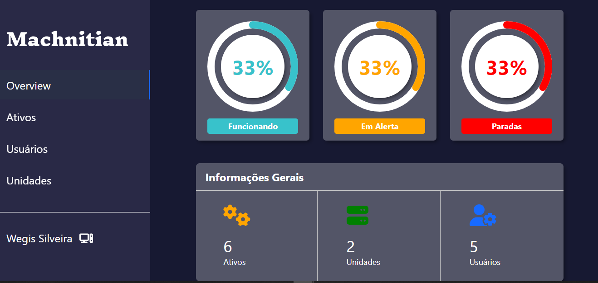
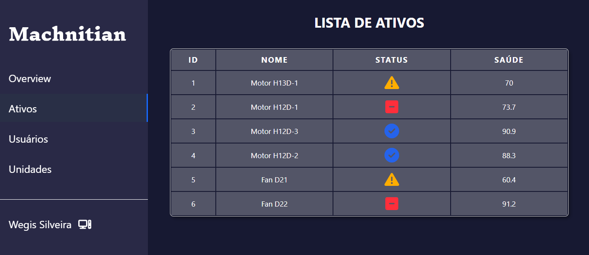
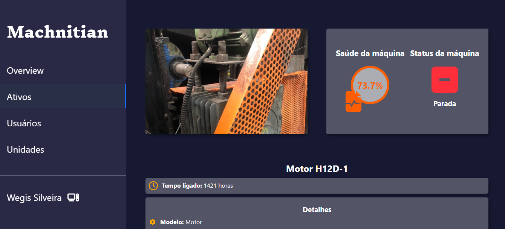
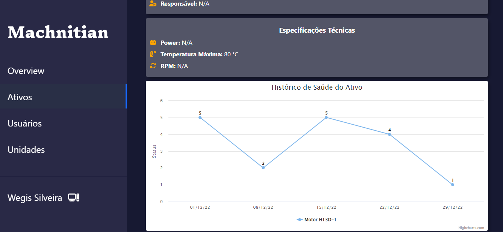
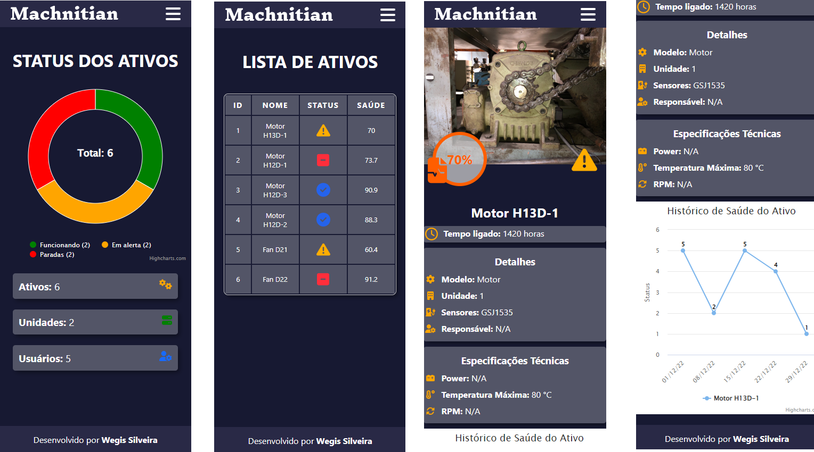

# Machnitian
<table>
<tr>
<td>
 Application created to show a list of assets, users and details about a company.
</td>
</tr>
</table>

## Demo
Here is a working live demo :  https://wegis.com.br/machnitian

## Website

### Assets Page

### Asset Details Page

## Mobile support
<em>The application</em> is compatible with devices of all sizes.

### Bug / Feature Request

If you find a bug (the website couldn't handle the query and / or gave undesired results), kindly open an issue [here](https://github.com/wegissilveira/machnitian/issues).

If you'd like to request a new function, feel free to do so by opening an issue [here](https://github.com/wegissilveira/machnitian/issues).

## Built with 

- [React](https://reactjs.org/) - React makes it painless to create interactive UIs.
- [Redux](https://redux.js.org/) - A Predictable State Container for JS Apps.
- [SASS](https://sass-lang.com/) - Sass is the most mature, stable, and powerful professional grade CSS extension language in the world.
- [TypeScript](https://www.typescriptlang.org/) - A strongly typed programming language which builds on JavaScript giving you better tooling at any scale..
- [Highcharts](https://www.highcharts.com/) - Javascript library to create interactive charts for web and mobile projects.
- [Axios](https://axios-http.com/docs/intro) - A a promise-based HTTP Client for node.js and the browser.
- [Font Awesome](https://fontawesome.com/v5/docs/web/use-with/react) - Font Awesome is the Internet's icon library and toolkit, used by millions of designers, developers, and content creators.
- [React Circular Progressbar](https://www.npmjs.com/package/react-circular-progressbar) - A circular progressbar component, built with SVG and extensively customizable.
- [Moment.js](https://momentjs.com/) - Parse, validate, manipulate and display dates and times in JavaScript.
